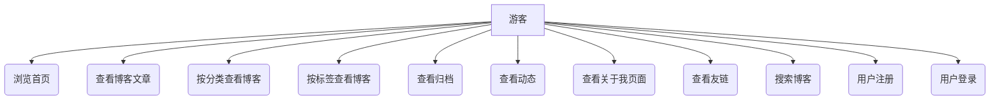

# NBlog 系统角色与功能分析

## 1. 角色划分

表2.1 用户角色划分表

| 角色     | 职责或功能                                                                                                                                                                                                                                                                                                                                                                                        |
| :------- | :------------------------------------------------------------------------------------------------------------------------------------------------------------------------------------------------------------------------------------------------------------------------------------------------------------------------------------------------------------------------------------------------ |
| 管理员   | 管理博客（增删改查、设置分类/标签/置顶等）、评论（查看、审核、删除）、分类（增删改查）、标签（增删改查）、动态（增删改查）、友链（增删改查、审核）、"关于我"页面内容、站点设置、定时任务、日志（登录、异常、操作、访问）、访客信息、仪表盘数据查看、账户管理（修改自己的密码）、词频分析等。                                                                                                                                                                            |
| 注册用户 | 浏览网站所有公开内容（首页、博客、分类、标签、归档、动态、关于我、友链）、搜索博客、发表评论、回复评论。**用户中心功能**：注册、登录、获取/修改个人信息（昵称、邮箱、头像）、修改密码、修改账号（用户名）和密码。**内容管理权限**：管理个人发布的博客（增删改查、设置分类/标签）、管理个人发布的动态（增删改查）、管理个人发表的评论（修改、删除、设置公开状态/邮件提醒）、收藏/取消收藏博客。 |
| 游客     | 浏览网站所有公开内容（首页、博客文章详情、分类博客列表、标签博客列表、归档页面、动态列表、关于我页面、友链页面）、搜索博客、进行用户注册、用户登录。                                                                                                                                                                                                                                                           |

## 2. 功能说明

表2.2 功能基本信息表

| 功能模块           | 功能点                                                 | 描述                                                                                                     | 角色             |
| :----------------- | :----------------------------------------------------- | :------------------------------------------------------------------------------------------------------- | :--------------- |
| **后台管理**       |                                                        |                                                                                                          |                  |
| 仪表盘             | 查看网站统计数据                                       | 显示PV、UV、博客数、评论数、分类/标签博客数、访客记录、城市访客分布等。                                            | 管理员           |
| 博客管理           | 增、删、改、查博客，设置分类、标签、置顶、可见性等       | 管理员对所有博客文章进行全面的管理。                                                                         | 管理员           |
| 评论管理           | 查看、审核、删除、编辑所有评论                         | 管理员管理网站内的所有评论。                                                                               | 管理员           |
| 分类管理           | 增、删、改、查博客分类                                 | 管理员管理博客的分类信息。                                                                                 | 管理员           |
| 标签管理           | 增、删、改、查博客标签                                 | 管理员管理博客的标签信息。                                                                                 | 管理员           |
| 动态管理           | 增、删、改、查动态                                     | 管理员管理网站发布的动态。                                                                                 | 管理员           |
| 友链管理           | 增、删、改、查友链，审核友链申请                       | 管理员管理网站的友情链接。                                                                                 | 管理员           |
| 关于我页面管理     | 编辑"关于我"页面内容                                   | 管理员更新"关于我"页面的信息。                                                                               | 管理员           |
| 站点设置           | 配置网站名称、LOGO、页脚、公告、API密钥等              | 管理员对网站的各项参数进行配置。                                                                             | 管理员           |
| 定时任务管理       | 查看、启动、暂停、删除、修改、执行定时任务             | 管理员管理后台的定时任务（如数据备份、统计任务等）。                                                           | 管理员           |
| 日志管理           | 查看登录日志、异常日志、操作日志、访问日志               | 管理员监控系统运行状态、错误及用户操作行为。                                                                   | 管理员           |
| 访客管理           | 查看访客记录、删除访客记录                             | 管理员查看网站的访客IP、访问时间、UA等信息。                                                                 | 管理员           |
| 管理员账户管理     | 修改自己的登录密码                                     | 管理员可以修改自己的账户密码。                                                                               | 管理员           |
| 词频分析           | 上传文档进行词频分析，查看分析结果                     | 管理员可以对文本内容进行词频统计。                                                                           | 管理员           |
| **前台通用功能**   |                                                        |                                                                                                          |                  |
| 首页浏览           | 查看博客列表、推荐内容                                 | 用户访问网站的入口，展示最新或推荐的博客。                                                                     | 所有用户         |
| 博客阅读           | 查看博客文章详情                                       | 用户阅读完整的博客文章内容。                                                                                 | 所有用户         |
| 博客搜索           | 按关键词搜索博客                                       | 用户通过关键词查找感兴趣的博客。                                                                               | 所有用户         |
| 分类浏览           | 按分类查看博客列表                                     | 用户根据分类筛选浏览博客。                                                                                   | 所有用户         |
| 标签浏览           | 按标签查看博客列表                                     | 用户根据标签筛选浏览博客。                                                                                   | 所有用户         |
| 归档浏览           | 按月份/年份查看历史博客                                | 用户查找过去发布的博客。                                                                                     | 所有用户         |
| 动态浏览           | 查看动态列表                                           | 用户浏览网站发布的动态信息。                                                                                 | 所有用户         |
| 关于我页面查看     | 查看博主/网站介绍                                      | 用户了解博主或网站背景。                                                                                     | 所有用户         |
| 友链页面查看       | 查看友情链接列表                                       | 用户访问其他相关网站。                                                                                     | 所有用户         |
| **用户账户与交互** |                                                        |                                                                                                          |                  |
| 用户注册           | 创建新的用户账号                                       | 游客通过提供用户名、密码、昵称、邮箱注册成为网站用户。                                                           | 游客             |
| 用户登录           | 使用账号密码登录                                       | 已注册用户或管理员登录系统。                                                                                 | 游客、注册用户   |
| 评论与回复         | 对博客、页面发表评论，回复他人评论                     | 注册用户可以参与讨论和互动。                                                                                 | 注册用户         |
| 获取个人信息       | 查看自己的用户名、昵称、邮箱、头像等                   | 注册用户查看自己的账户资料。                                                                                 | 注册用户         |
| 修改个人信息       | 修改昵称、邮箱、头像等                                 | 注册用户更新自己的个人资料（不含用户名和密码）。                                                                 | 注册用户         |
| 修改密码           | 修改当前账户的登录密码                                 | 注册用户修改自己的账户密码。                                                                                 | 注册用户         |
| 修改账号与密码     | 修改当前账户的用户名和密码                             | 注册用户可以同时修改自己的用户名和登录密码。                                                                   | 注册用户         |
| 用户头像上传       | 上传/更换个人头像图片                                  | 注册用户可以个性化自己的头像显示。                                                                             | 注册用户         |
| **用户内容管理**   |                                                        |                                                                                                          |                  |
| 个人博客管理       | 创建、编辑、删除、查询个人发布的博客，设置分类/标签    | 注册用户管理自己发布的博客文章。                                                                               | 注册用户         |
| 个人动态管理       | 创建、编辑、删除、查询个人发布的动态                   | 注册用户管理自己发布的动态信息。 (依赖 `Moment` 实体与用户ID的正确关联)                                          | 注册用户         |
| 个人评论管理       | 查询、修改、删除个人发表的评论，设置评论公开/邮件提醒  | 注册用户管理自己发表的评论。                                                                                 | 注册用户         |
| 博客收藏           | 收藏/取消收藏喜欢的博客文章                            | 注册用户可以标记和管理自己感兴趣的博客。                                                                       | 注册用户         |

## 3. 系统用例图

以下为系统用例的文字描述，可用于绘制用例图。

### 3.1 游客

*   **Actor:** 游客
*   **Use Cases:**
    *   浏览首页
    *   查看博客文章
    *   按分类查看博客
    *   按标签查看博客
    *   查看归档
    *   查看动态
    *   查看关于我页面
    *   查看友链
    *   搜索博客
    *   用户注册
    *   用户登录

### 3.2 注册用户

*   **Actor:** 注册用户 (extends 游客)
*   **Use Cases (extends 游客的用例):**
    *   发表评论 (includes: 身份验证)
    *   回复评论 (includes: 身份验证)
    *   查看个人信息 (includes: 身份验证)
    *   修改个人信息 (includes: 身份验证)
    *   修改密码 (includes: 身份验证)
    *   修改账号与密码 (includes: 身份验证)
    *   上传头像 (includes: 身份验证)
    *   管理个人博客 (增/删/改/查) (includes: 身份验证)
    *   管理个人动态 (增/删/改/查) (includes: 身份验证)
    *   管理个人评论 (查/改/删/设置状态) (includes: 身份验证)
    *   收藏博客 (includes: 身份验证)
    *   取消收藏博客 (includes: 身份验证)
    *   退出登录

### 3.3 管理员

*   **Actor:** 管理员 (extends 注册用户)
*   **Use Cases (extends 注册用户的用例, 但主要关注管理功能):**
    *   登录后台 (通常与前台登录区分或有特定入口)
    *   查看仪表盘
    *   管理所有博客 (增/删/改/查/设置)
    *   管理所有评论 (查/审/删/改)
    *   管理分类 (增/删/改/查)
    *   管理标签 (增/删/改/查)
    *   管理所有动态 (增/删/改/查)
    *   管理友链 (增/删/改/查/审)
    *   管理"关于我"页面
    *   管理站点设置
    *   管理定时任务
    *   查看各类日志
    *   管理访客信息
    *   管理词频分析
    *   (管理员通常不直接使用普通用户的"修改账号与密码",而是有专门的"修改管理员密码"或通过后台账户管理) 